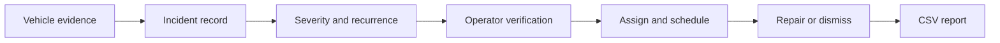
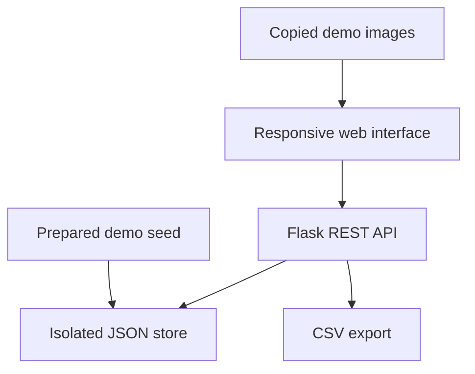

# RoadSense Response

## Problem and approach

Vehicle-based pothole detection can produce hundreds of images and sensor events, but detection alone does not repair a road. RoadSense Response is a focused product layer for road maintenance operators. It turns a small set of camera, accelerometer, GPS, and recurrence signals into an understandable priority and then moves the incident through a repair workflow.

The challenge prototype deliberately goes deep on two features. First, an operator can search, filter, sort, and triage incidents using a map, severity queue, source image, evidence bars, and a recommended action. Second, the operator can update status, assign a team, add notes, preserve a timestamped activity history, and export a CSV repair queue.

The app is based on the problem explored in my pothole-detection FYP, but it is implemented as a separate product. It does not import or write to the FYP source, model files, raw logs, labels, configuration, or sensor pipeline. The included screenshots are copied demo evidence and the seed records are manually prepared and location-rounded.

## Key decisions

- **Flask plus vanilla JavaScript:** This matches my strongest stack and keeps setup short for reviewers. A single process serves both the interface and REST API.
- **Explainability before automation:** The severity display separates visual confidence, impact strength, and recurrence. A human remains responsible for verification and repair decisions.
- **Local JSON persistence and audit history:** The prototype needs visible end-to-end behavior, not production infrastructure. Atomic file replacement preserves changes and an operator-readable history after refresh.
- **Relative map:** The interface communicates geographic grouping without requiring a map API key or external service.
- **Two strong workflows:** Triage and response are complete enough to demonstrate product thinking. Authentication, live ingestion, and municipal integrations are intentionally deferred.

## Feature flow

## Technical architecture

## Challenges and improvements

The main design challenge was presenting multiple uncertain signals without implying that the score is a validated engineering measurement. The interface therefore shows the underlying evidence, displays a field-verification warning, keeps a human in the loop, and supports dismissal of false positives. Another challenge was protecting the academic project, solved by making the challenge app fully independent and limiting it to prepared demo data.

With more time, I would add authenticated roles, a spatial database, a real map, mobile crew updates with before-and-after photos, audit history, and API-based ingestion from the detection device. I would also validate severity against road-condition measurements and maintenance outcomes before using it operationally.

## Tech stack

Python 3, Flask, HTML, CSS, vanilla JavaScript, JSON persistence, and Python `unittest`.
